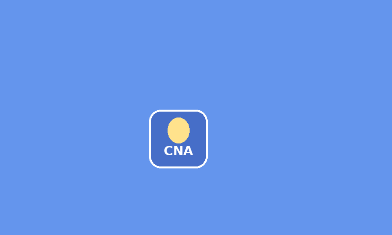

# cna-template

A starter template for building applications on top of **CNA**, a C++
reimplementation of the XNA 4.0 game framework programming model, built on
SDL3 with a pluggable graphics backend layer.

CNA lives in a sibling repository (default: `../cna` next to this checkout —
see the [CNA project](https://github.com/openeggbert/cna) for details). If
your CNA checkout lives somewhere else or under a different name, pass
`-DCNA_ROOT_DIR=/path/to/cna` to CMake.



## Quick start

```bash
cd ..
git clone https://github.com/openeggbert/cna.git
git clone https://github.com/openeggbert/sharp-runtime.git
cd cna-template
cmake --preset sdl-renderer
cmake --build --preset sdl-renderer
./cmake-build-sdl-renderer/HelloGame
```

That's the fastest path to a running window (arrow keys move the sprite,
Escape quits). See [Prerequisites](#prerequisites) below for what else you
need for other backends/platforms.

## Project structure

```
CMakeLists.txt          root build script: sibling-CNA path, backend selection, per-platform target setup
CMakePresets.json        one preset per backend, plus a Windows/Visual Studio preset
cmake/toolchains/        MinGW-w64 cross-compilation toolchain file
include/HelloGame/       HelloGame.hpp -- delete/replace with your own game
src/HelloGame/           HelloGame.cpp, Program.cpp (entry point) -- delete/replace with your own game
Content/                 game assets (PNG/WAV/OGG/etc. -- never .xnb, see the porting guide below)
android/                 Gradle project; points at this repo's own CMakeLists.txt
docs/                    README assets (the screenshot above)
missing.md               upstream CNA/sharp-runtime/mobile-eggbert issues found while building this template
plan.md, NEXT.md         this template's own development history/planning notes
```

This template ships:

- **CMake wiring for all 5 CNA graphics backends** (`SDL_RENDERER`, `EASYGL`,
  `BGFX`, `VULKAN`, `WEBGPU`), selectable at configure time.
- **`HelloGame`**, a minimal interactive example (`include/HelloGame/`,
  `src/HelloGame/`) — loads a texture, draws it, and moves it with the arrow
  keys. Delete/replace it with your own game; that's the point of a
  template.
- **Android** and **Web (Emscripten)** build support, in addition to native
  Linux and Windows.
- **Visual Studio** support via CMake integration files (see [Windows /
  Visual Studio](#windows--visual-studio) below).
- A guide for **porting an existing XNA 4.0 C# game** to this template (see
  [Porting a C# XNA 4.0 game](#porting-a-c-xna-40-game) below).

## Prerequisites

- CMake 3.21+
- A C++23 compiler (GCC/Clang on Linux, MSVC or MinGW-w64 on Windows)
- The sibling repositories CNA needs: `../cna`, `../sharp-runtime`, and (for
  the `EASYGL` backend) `../easy-gl`, all cloned next to this repository.
- Platform-specific tools as needed: Android Studio + NDK for Android,
  Emscripten (emsdk) for Web.

```bash
cd ..
git clone https://github.com/openeggbert/cna.git
git clone https://github.com/openeggbert/sharp-runtime.git
git clone https://github.com/openeggbert/easy-gl.git   # only needed for EASYGL
cd cna-template
```

CNA itself vendors SDL3/SDL3_image/SDL3_mixer and builds them from source on
first configure (cached afterwards) — see `../cna/README.md` for details on
that process and its own prerequisites.

## Building (Linux / native Windows / MinGW cross-compile)

| Backend | Platforms | 2D/3D | Status in this repo |
|---|---|---|---|
| `SDL_RENDERER` | Linux, Windows, Web, Android (forced on the latter two) | 2D only | Verified — builds and runs HelloGame cleanly on Linux |
| `EASYGL` | Linux, Windows | 2D + 3D | Verified — builds and runs HelloGame cleanly on Linux (CNA's most mature backend) |
| `BGFX` | Linux, Windows | 2D + 3D | Not built/run in this environment |
| `VULKAN` | Linux, Windows | 2D + 3D | Not built/run in this environment |
| `WEBGPU` | Linux, Windows (experimental) | 2D + 3D | Only available if your `../cna` checkout defines the `cna_backend_graphics_webgpu` target — see note below |

"Verified" means actually built and run (not just compiled) with `SDL_VIDEODRIVER=dummy` / `xvfb-run`, watching for exceptions and correct backend capability logging — see `missing.md` for the bugs that surfaced this way and are now fixed upstream.

Using a CMake preset (see `CMakePresets.json` for the full list —
`sdl-renderer`, `easygl`, `bgfx`, `vulkan`, `webgpu`):

```bash
cmake --preset easygl
cmake --build --preset easygl
./cmake-build-easygl/HelloGame
```

Or without presets, selecting a backend directly:

```bash
cmake -S . -B build -DCNA_GRAPHICS_BACKEND=EASYGL
cmake --build build --target HelloGame
./build/HelloGame
```

`CNA_GRAPHICS_BACKEND` is one of `SDL_RENDERER`, `EASYGL`, `BGFX`, `VULKAN`,
`WEBGPU` (equivalently, set exactly one of the `CNA_BACKEND_*` boolean
options). **`WEBGPU` is experimental and only available if your `../cna`
checkout defines the `cna_backend_graphics_webgpu` target** — if it doesn't,
CMake's own configure step now fails with a clear, specific error
("known CNA backend name, but this checkout does not yet define a
cna_backend_graphics_webgpu target") rather than a confusing generic message
or a silent link failure. Update your CNA checkout if you hit that.

### MinGW-w64 cross-compilation from Linux

```bash
rm -rf build-windows   # always use a clean build dir when switching toolchains
cmake -S . -B build-windows \
  -DCMAKE_TOOLCHAIN_FILE=cmake/toolchains/mingw-w64.cmake \
  -DCNA_GRAPHICS_BACKEND=SDL_RENDERER \
  -DCNA_WINDOWS_DEPENDENCIES_ROOT=/path/to/windows/sdl3/libs
cmake --build build-windows --target HelloGame
```

You must provide Windows-target SDL3 package configs (`SDL3`, `SDL3_image`,
`SDL3_mixer`) via `CNA_WINDOWS_DEPENDENCIES_ROOT` or `CMAKE_PREFIX_PATH`.

## Windows / Visual Studio

Visual Studio support is delivered as **CMake integration files**
(`CMakePresets.json`'s `windows-vs2022` preset), not a hand-authored
`.sln`/`.vcxproj`. Visual Studio 2019 16.10+ and 2022 read `CMakePresets.json`
natively:

1. **File > Open > Folder...** and select the `cna-template` directory.
2. Visual Studio detects `CMakePresets.json` and offers the `windows-vs2022`
   configure preset (and the others, cross-platform ones aside — CMake
   Tools for VS can target them too if you have the right toolchains
   installed).
3. Select the `HelloGame` startup item and build/debug as usual (Ctrl+Shift+B / F5).

Equivalently, from a **Developer Command Prompt**:

```powershell
cmake --preset windows-vs2022
cmake --build --preset windows-vs2022
```

This generates the real `.sln`/`.vcxproj` files under `cmake-build-vs2022/`
on demand — they are not committed, since CMake regenerates them from
`CMakeLists.txt` and would otherwise go stale. This has not been build-tested
on this machine (no Visual Studio/MSBuild available in this environment) —
please verify directly on Windows.

## Web (Emscripten)

```bash
source /path/to/emsdk/emsdk_env.sh
emcmake cmake --preset web
cmake --build --preset web
emrun cmake-build-web/HelloGame.html
```

`Content/` is preloaded into the Emscripten virtual filesystem at `/Content`
(see the `EMSCRIPTEN` branch of `CMakeLists.txt`). Only `SDL_RENDERER` is
supported on Web (forced automatically). Verified on this machine: configures
and builds cleanly, produces `HelloGame.html/.js/.wasm/.data`, and the asset
preload correctly embeds `Content/logo.png` into the output bundle.

## Android

```bash
cd android
./gradlew assembleDebug
adb install app/build/outputs/apk/debug/app-debug.apk
adb shell am start -n org.openeggbert.cnatemplate/.HelloGameActivity
```

The Android project (`android/`) points its CMake `externalNativeBuild` at
this repository's own root `CMakeLists.txt` and builds `libmain.so`, loaded
by SDL3's `SDLActivity` Java glue (vendored in `../cna/third_party/SDL/`,
referenced via a relative path in `android/app/build.gradle` — update that
path if your CNA checkout isn't at the default `../cna`). `Content/` is
packaged into the APK via a symlink at
`android/app/src/main/assets/Content` pointing back to the real `Content/`
directory, so there's a single source of truth for assets.

Only `SDL_RENDERER` is supported on Android (forced automatically, same as
Web). Not build-tested on this machine (no Android SDK/NDK available here).

To build a signed release APK, generate a keystore and `android/key.properties`
(never commit either — both are gitignored):

```bash
cd android
keytool -genkeypair -v -keystore cna-template-release.keystore \
  -alias cna-template -keyalg RSA -keysize 2048 -validity 10000
```

```properties
# android/key.properties
storeFile=cna-template-release.keystore
storePassword=YOUR_STORE_PASSWORD
keyAlias=cna-template
keyPassword=YOUR_KEY_PASSWORD
```

```bash
./gradlew clean assembleRelease
```

## Porting a C# XNA 4.0 game

If you're not writing a new game from scratch but porting an existing XNA
4.0 C# project, the sibling repository
[`cna-samples`](https://github.com/openeggbert/cna-samples) — dozens of the
official Microsoft XNA Game Studio 4.0 samples, ported to CNA/C++ — is the
best reference for real, working examples of every rule below.

### Mechanical C#→C++ rules

- **Properties become getter/setter pairs.** CNA has no public fields for
  XNA properties: a C# `Foo` property becomes `getFooProperty()` /
  `setFooProperty(value)`. For example:
  ```csharp
  // C#
  graphics.PreferredBackBufferWidth = 800;
  var width = device.Viewport.Width;
  ```
  ```cpp
  // CNA
  graphics.setPreferredBackBufferWidthProperty(800);
  auto width = device.getViewportProperty().getWidthProperty();
  ```
- **Every concrete `Game` subclass needs `GetTypeName()` boilerplate.**
  Declare `GetTypeNameHPP()` inside the class body in your header, and
  `GetTypeNameCPP(YourClassName, "YourClassName")` at file scope in your
  `.cpp`. This is CNA/sharp-runtime bookkeeping with no XNA equivalent, but
  it's required to compile — see `include/HelloGame/HelloGame.hpp` and
  `src/HelloGame/HelloGame.cpp` for a working example.
- **Namespaces carry over unchanged**: `Microsoft::Xna::Framework`,
  `...::Graphics`, `...::Audio`, `...::Input`, `...::Content`, etc. match
  real XNA/FNA namespaces, so existing API knowledge transfers directly.
- **No garbage collector.** Object lifetime must be explicit:
  `std::unique_ptr`, RAII, or (matching some of CNA's own examples) manual
  `new`/`delete`. `new Foo()` in C# usually becomes a stack value or
  `std::make_unique<Foo>()` in C++.
- **Common type mappings**: `List<T>` → `std::vector<T>`, `string` →
  `std::string`, `foreach` → range-`for`, nullable → `std::optional`,
  `TimeSpan` → `System::TimeSpan` (from sharp-runtime).
- **`GraphicsDevice::Clear(const Color&)` is safe on every backend, including
  `SDL_RENDERER`.** The single-`Color` overload clears target+depth+stencil
  together to match real XNA/FNA semantics; on the 2D-only `SDL_RENDERER`
  backend (no depth/stencil buffer at all), CNA now degrades this to a
  color-only clear instead of throwing (fixed upstream in `../cna`, see
  `missing.md`). `HelloGame` uses `device.Clear(Color::CornflowerBlue)`
  directly — no workaround needed.

### Assets: CNA never reads `.xnb`

CNA does not support `.xnb` (the compiled XNA Content Pipeline binary
format) and is not expected to ever support it — confirmed directly in CNA's
own `Effect.hpp` (the bytecode-`Effect` constructor always throws
`NotImplementedException`). You need your original *source* assets (the
files that existed before the Content Pipeline compiled them into `.xnb`),
or you need to extract them from `.xnb` using an external tool such as
MonoGame's `mgcb`/`MonoGame.Content.Builder` — CNA and this template ship no
XNB reader of any kind.

| XNA asset type | CNA-loadable format |
|---|---|
| `Texture2D` | PNG (or anything SDL3_image reads) |
| `SoundEffect` / `Song` | WAV / OGG |
| `Model` | glTF or OBJ — `cna-samples/tools/obj2model.py` and `fbx_ascii2model.py` convert to CNA's `.model.json` + binary buffers |
| `SpriteFont` | CNA's own `.font.json` descriptor + PNG glyph atlas — `cna-samples/tools/make_font.py <ttf> <size_px> <out>` generates both from a TrueType font |
| `Effect` (compiled `.fx`) | Hand-translated GLSL via CNA's `ShaderEffect` (takes GLSL source strings directly, no file loader built in), or one of CNA's built-in stock effects: `BasicEffect`, `AlphaTestEffect`, `DualTextureEffect`, `EnvironmentMapEffect`, `SkinnedEffect`, `SpriteEffect` |

Loading a texture without `.xnb`, via `ContentManager` (the idiomatic way —
`ContentManager::RootDirectory` defaults to `"Content"`, and you can omit the
file extension):

```cpp
auto texture = getContentProperty().Load<Texture2D>("logo"); // loads Content/logo.png
```

### Recommended porting workflow

1. Get the original C# XNA source and its *source* assets (not just the
   `.xnb` output) if at all possible.
2. Convert assets per the table above.
3. Port the `Game` subclass mechanically using the rules above — start from
   `HelloGame` as a working skeleton.
4. Consult `../cna-samples` for a real, working, already-ported example of
   whatever XNA API you're unsure about — it's a much better reference than
   guessing from the XNA docs alone, since it already has the C++/CNA
   equivalent worked out.

## Known upstream issues

Actually building and running (not just compiling) `HelloGame` against CNA
surfaced a handful of real bugs and gaps in CNA, sharp-runtime, and
mobile-eggbert (the structural model this template is based on) — startup
crashes, a visible startup flicker, a CMake scoping question, a MinGW
cross-compile dependency gap. See [`missing.md`](missing.md) for the full
write-up: what was found, how it was confirmed, and which of them are
already fixed upstream vs. still open.

## License

MIT — see [LICENSE](LICENSE).
