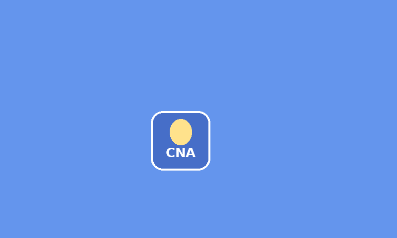

# cna-template

A starter project for **[CNA](https://github.com/openeggbert/cna)** — a C++
reimplementation of the XNA 4.0 game framework, built on SDL3 with a pluggable
renderer layer.

Clone it, pick a renderer, build, and you have a running game loop with content
loading, sprite drawing and input. Then delete `HelloGame` and write your own.



---

## Contents

- [What you get](#what-you-get)
- [Quick start](#quick-start)
- [Prerequisites](#prerequisites)
- [Choosing a renderer](#choosing-a-renderer)
- [Project structure](#project-structure)
- [Making this your own project](#making-this-your-own-project)
- [Building](#building)
  - [Linux](#linux) · [Windows](#windows) · [Web](#web-emscripten) ·
    [Android](#android) · [macOS](#macos)
- [Tests](#tests)
- [Content and assets](#content-and-assets)
- [Porting a C# XNA 4.0 game](#porting-a-c-xna-40-game)
- [Troubleshooting](#troubleshooting)
- [Known upstream issues](#known-upstream-issues)

---

## What you get

- A working `Game` subclass with `LoadContent` / `Update` / `Draw`, texture
  loading, `SpriteBatch` drawing and keyboard input.
- A build that works with **any** of CNA's 50 renderers, and refuses invalid
  renderer/platform combinations with an explanation rather than a link error.
- Ready-made presets for the common renderers, generated from one manifest.
- A smoke test that runs in CI with no display at all.
- Packaging for Linux, Windows, Web and Android.

This is deliberately a *starter*, not a sample gallery. For worked examples of
specific XNA features, see
[cna-samples](https://github.com/openeggbert/cna-samples).

---

## Quick start

```bash
# CNA and its dependencies are sibling checkouts, not submodules.
git clone https://github.com/openeggbert/cna.git
git clone https://github.com/openeggbert/sharp-runtime.git
git clone https://github.com/openeggbert/cna-template.git

# CNA vendors SDL as submodules and needs them present.
git -C cna submodule update --init \
    third_party/SDL third_party/SDL_image third_party/SDL_mixer third_party/enet

cd cna-template
cmake --preset headless
cmake --build --preset headless -j3
ctest --preset headless
```

`headless` needs no GPU, no window and no display server, which makes it the
fastest way to prove the toolchain works. For something you can actually look
at, use `sdl-renderer` (most portable) or `opengles3` (CNA's default on Linux —
also clone `easy-gl` and `meta-gl` first, see below).

---

## Prerequisites

**Always:**

| | |
| --- | --- |
| CMake | 3.23 or newer |
| Compiler | C++23 (GCC 14+, Clang 18+, MSVC 19.38+) |
| Siblings | `../cna`, `../sharp-runtime` |
| CNA submodules | `third_party/SDL`, `SDL_image`, `SDL_mixer`, `enet` |

On Linux you also need `pkg-config` and the FFmpeg development packages, which
CNA's media module requires unconditionally there:

```bash
sudo apt-get install -y cmake ninja-build pkg-config ccache \
    libavcodec-dev libavformat-dev libavutil-dev libswresample-dev
```

**Renderer-dependent extra checkouts** — clone these only if you use the
renderers that need them:

| Checkout | Needed by |
| --- | --- |
| `../easy-gl` **and** `../meta-gl` | `OPENGLES2`, `OPENGLES3`, `OPENGL33`, `WEBGL1`, `WEBGL2` |
| `../free-direct` | `FREEDIRECT` |

`docs/renderers.md` lists the dependency for every renderer. Nothing else is a
blanket prerequisite: most renderers need only CNA and sharp-runtime, and
several fetch what they need at configure time.

CNA builds SDL3 itself, once, into a cache directory outside the build tree, so
the first configure is slow and later ones are not. You do not need system SDL.

`dependencies.lock` records the exact revisions this template was last audited
against.

---

## Choosing a renderer

One cache variable selects the renderer, and it is CNA's own:

```bash
cmake -S . -B build -DCNA_GRAPHICS_RENDERER=OPENGLES3
```

Set nothing and CNA picks: `WEBGL2` on the web, `OPENGLES3` on Linux,
`SDL_RENDERER` everywhere else.

Renderers with a preset:

```bash
cmake --list-presets
```

Everything else is selected with `-DCNA_GRAPHICS_RENDERER=<NAME>`. All 46 are
selectable either way — the presets are a convenience, not a whitelist.

**➡ [docs/renderers.md](docs/renderers.md) — the full matrix**: what each
renderer is, which platforms it runs on, whether it opens a window, whether it
does 3D, what it depends on, and how far this template's CI exercises it.

A few things worth knowing before you choose:

- Renderers are **not** interchangeable. Eleven are 2D-only and throw on
  `VertexBuffer`, `DrawUserPrimitives` and depth state.
- Four open **no window at all** (`HEADLESS`, `SOFTWARE`, `STUB`, `PORTABLEGL`).
  They need no X server and no GPU, which makes them ideal for CI and servers.
  `SOFTWARE` and `PORTABLEGL` really do rasterize; they just present nowhere.
- Ask the device what it supports rather than testing its name:

  ```cpp
  if (device.SupportsCapability(CNA::GraphicsCapability::ThreeD)) { ... }
  ```

  `GetGraphicsRendererName()` exists, but for display only.

If you pick a renderer that cannot work where you are building, the configure
stops and tells you why, what the renderer *does* support, and which renderers
would work instead.

---

## Project structure

```
game/include/HelloGame/   your headers
game/src/                 your sources (HelloGame.cpp, Program.cpp)
Content/                  assets, copied next to the executable at build time
cmake/renderers.json      renderer metadata — the one place it lives
cmake/CnaRenderers.cmake  renderer validation and CNA drift checks
cmake/toolchains/         MinGW-w64 cross-compilation toolchain
tools/                    generator for presets and docs/renderers.md
android/                  Gradle project
docs/renderers.md         generated renderer matrix
```

Sources live under `game/` rather than the usual `src/` + `include/` because a
top-level `src/` or `include/` currently breaks CNA's build — see
[Known upstream issues](#known-upstream-issues). The build tells you this if you
recreate them.

`CMakePresets.json` and `docs/renderers.md` are **generated** from
`cmake/renderers.json`:

```bash
python3 tools/gen_renderer_files.py          # regenerate
python3 tools/gen_renderer_files.py --check  # what CI runs
```

The generator also cross-checks the manifest against CNA's own canonical
renderer list, and the build re-checks it twice more at configure time, so this
template cannot silently fall behind CNA the way it did before.

---

## Making this your own project

1. **Rename the executable** — set `CNA_TEMPLATE_APP_NAME` in `CMakeLists.txt`,
   or pass `-DCNA_TEMPLATE_APP_NAME=MyGame`.
2. **Rename the class** — rename `game/src/HelloGame.cpp` and
   `game/include/HelloGame/HelloGame.hpp`, update the `HELLOGAME_SOURCES` entries
   in `CMakeLists.txt`, and keep the two bookkeeping macros in step:
   `GetTypeNameHPP()` in the header and `GetTypeNameCPP(MyGame, "MyGame")` at
   file scope in the `.cpp`. Both are required to compile.
3. **Replace `Content/logo.png`** with your own assets.
4. **Change the Android application id** — `android/app/build.gradle`
   (`applicationId`) and the package in `android/app/src/main/AndroidManifest.xml`.
5. **Pick your renderers** — set `preset` and `tier` in `cmake/renderers.json`
   for the ones you care about, then regenerate.
6. Delete this README and write your own.

---

## Building

### Linux

```bash
cmake --preset opengles3
cmake --build --preset opengles3 -j3
```

Or without a preset:

```bash
cmake -S . -B build -DCMAKE_BUILD_TYPE=Release -DCNA_GRAPHICS_RENDERER=VULKAN
cmake --build build -j3
```

### Windows

**Native (MSVC)** — open the folder in Visual Studio, or:

```bat
cmake -S . -B build -G "Visual Studio 17 2022" -A x64 -DCNA_GRAPHICS_RENDERER=SDL_RENDERER
cmake --build build --config Release
```

Required runtime DLLs are copied next to the executable automatically.

**Cross-compiling from Linux** with the bundled MinGW-w64 toolchain — this is
also how you build the Windows-only renderers (`DIRECTX1`–`DIRECTX12`,
`DIRECT2D`, `GDI`, `GLIDE`):

```bash
cmake --preset windows-directx11
cmake --build --preset windows-directx11 -j3
```

`CNA_WINDOWS_DEPENDENCIES_ROOT=/path/to/mingw-prefix` remains available for a
renderer or game that needs extra Windows-target packages. The base template
does not need a target zlib: it selects CNA's actual Sharp Runtime component
closure instead of the default all-components build. If your own code adds
`SharpRuntime::IO.Compression`, provide a target zlib in the usual way.

The resulting directory is self-contained: CNA's SDL DLLs and the dynamic
MinGW C++ runtime are copied next to the executable. The C++ runtime must stay
dynamic because MinGW's static libstdc++ cannot link CNA's full RTTI graph.

Several of those need more than a compiler to *run*: `DIRECTX8` and `DIRECTX10`
are delivered through DXVK, and `GLIDE` needs a 32-bit toolchain plus an
external `glide3x.dll`. `docs/renderers.md` records this per renderer.

### Web (Emscripten)

Needs the [Emscripten SDK](https://emscripten.org/docs/getting_started/downloads.html)
active (`source emsdk_env.sh`). The web presets carry the toolchain file, so
`emcmake` is optional:

```bash
cmake --preset web-webgl2
cmake --build --preset web-webgl2 -j3
```

Produces `HelloGame.html` / `.js` / `.wasm` / `.data`. Serve it over HTTP —
`file://` will not work:

```bash
python3 -m http.server -d build-web-webgl2
```

Five renderers target the web: `WEBGL2` (CNA's default), `WEBGL1`, and the three
DOM renderers `CANVAS`, `HTML_DOM` and `SVG_DOM`, which use no WebGL at all.
The WebGL version flags are applied **per renderer** — forcing WebGL 2 globally,
as this template used to, silently breaks `WEBGL1`.

### Android

Needs the Android SDK, NDK and JDK 17.

```bash
cd android
./gradlew assembleDebug -PcnaRootDir=/path/to/cna
```

The APK lands in `android/app/build/outputs/apk/debug/`. Assets from `Content/`
are packaged automatically. The native library must stay named `main` and the
entry point must be `SDL_main`, because that is what SDL's Java glue looks for.

CNA's own documentation currently disagrees with itself about the state of the
Android cross-build — see [Known upstream issues](#known-upstream-issues).

### macOS

`METAL` is macOS-only, and CNA states plainly that iOS and tvOS are unvalidated.
Most cross-platform renderers (`SDL_RENDERER`, the GL family, `HEADLESS`,
`SOFTWARE`, …) also target macOS. None of this was verified on this machine —
`docs/renderers.md` marks what has actually been tested.

---

## Tests

The smoke test builds the game, runs it for three frames and exits. It is
labelled by what it needs from the environment:

```bash
ctest --test-dir build -L headless          # no display needed at all
xvfb-run -a ctest --test-dir build -L display
```

or via the preset, which selects the right label for you:

```bash
ctest --preset headless
```

Turn it off with `-DCNA_TEMPLATE_BUILD_TESTS=OFF`.

---

## Content and assets

`ContentManager` defaults to a `Content` directory beside the executable, and
this build copies `Content/` there after every build. Extensions are optional:

```cpp
auto texture = getContentProperty().Load<Texture2D>("logo");   // Content/logo.png
```

| Asset | What CNA loads |
| --- | --- |
| Textures | `.png`, `.jpg`, `.bmp` and friends via SDL_image — **and real `.xnb`** |
| Models | `.gltf` / `.glb` directly, or `.cnj` (CNA's own format), or `.xnb` |
| SpriteFont | `.xnb` fonts from XNA/MonoGame, or a `.cnj` descriptor plus a glyph atlas |
| Audio | WAV, OGG Vorbis, MP3, FLAC, AIFF, MIDI; XACT `.xgs`/`.xwb`/`.xsb` too |
| Video | via FFmpeg on Linux/macOS; compiled out on Windows, Android and Web |
| Effects | the stock effects, or GLSL through a `.cnj` Effect envelope |

**`.xnb` works now.** Earlier versions of this README stated that CNA would
never read `.xnb` and that you had to extract your assets first. That is wrong:
CNA ships a full `.xnb` read path including LZX decompression, and
`ContentManager` probes `<asset>.xnb` before any loose file. Register the
built-in readers once at startup:

```cpp
CNA::Internal::Xnb::RegisterAllBuiltInXnbReaders();
```

What is genuinely *not* supported is **writing** `.xnb` (there is no content
pipeline — use the loose formats above), and **compiled `.fx` bytecode**, whose
`Effect` constructor still throws. Custom shaders are written as GLSL and need a
renderer that reports the `CustomEffects` capability.

---

## Porting a C# XNA 4.0 game

| C# | C++ / CNA |
| --- | --- |
| `namespace Microsoft.Xna.Framework` | `Microsoft::Xna::Framework` |
| `class Game1 : Game` | `class Game1 : public Microsoft::Xna::Framework::Game` |
| `obj.Property` | `obj.getPropertyProperty()` / `setPropertyProperty(v)` |
| `new Foo()` (GC) | value types, or `std::unique_ptr<Foo>` |
| `override void Draw(GameTime t)` | `void Draw(const GameTime& t) override` |
| `float`, `int`, `string` | `float`, `System::Int32`, `System::String` |

Every concrete `Game` subclass needs `GetTypeNameHPP()` in its header and
`GetTypeNameCPP(Name, "Name")` in its `.cpp`. This is CNA/sharp-runtime
bookkeeping, not XNA, but it is required to compile.

**Never call `GraphicsDevice::Present()` from `Draw()`.** `Game::EndDraw()`
already presents exactly once per frame, exactly as real XNA and FNA do.
Presenting twice makes SDL show an invalid backbuffer and the window flickers
every frame. CNA's own README still shows this incorrectly — see below.

[cna-samples](https://github.com/openeggbert/cna-samples) is the best reference
when you need the CNA equivalent of a specific XNA API.

---

## Troubleshooting

**`legacy global 'src/' tree reappeared at the repository root`** — you created a
top-level `src/` or `include/`. This is an upstream CNA bug; keep your sources
under `game/`. See below.

**`fatal error: cgltf.h: No such file or directory`** — the same upstream bug in
a different place. The template works around it; if you hit it in your own
project, add CNA's `third_party/cgltf` and `third_party/stb` to your include
path before `add_subdirectory(CNA)`.

**`unknown renderer CNA_GRAPHICS_RENDERER='EASYGL'`** — `EASYGL` was retired as a
renderer name; it is now the shared implementation behind `OPENGLES2`,
`OPENGLES3`, `OPENGL33`, `WEBGL1` and `WEBGL2`. Pick one of those.

**`renderer 'X' cannot target Y`** — the renderer is not available on the
platform you are building for. The message lists what does work.

**`Missing sibling repository 'easy-gl'`** — clone `easy-gl` *and* `meta-gl` next
to this project, or choose a renderer that does not need them.

**`Could NOT find PkgConfig` / missing `libav*`** — install the FFmpeg
development packages listed under [Prerequisites](#prerequisites).

**The window flickers every frame** — something is calling `Present()` in
`Draw()`. Remove it.

**A GL renderer fails under `SDL_VIDEODRIVER=dummy`** — the dummy driver has no
GL context. Use `xvfb-run`, or pick a renderer whose smoke test is labelled
`headless`.

---

## Known upstream issues

The blocking one: **CNA uses `CMAKE_SOURCE_DIR` where it means its own root**, in
`modules/CMakeLists.txt` and `modules/content/CMakeLists.txt`. Because
`CMAKE_SOURCE_DIR` is the *consumer's* top-level directory when CNA is added with
`add_subdirectory()`, any project with a conventional `src/` + `include/` layout
fails to configure, and `cgltf.h` is looked for in the wrong place. This template
works around both visibly, in its own files.

`missing.md` has the full list — each entry re-verified on 2026-08-11, with
evidence and the concrete upstream fix, including which previously reported bugs
are now fixed, obsolete, or were mistaken in the first place.

---

## License

MIT — see [LICENSE](LICENSE). CNA, sharp-runtime and the other dependencies
carry their own licenses.
